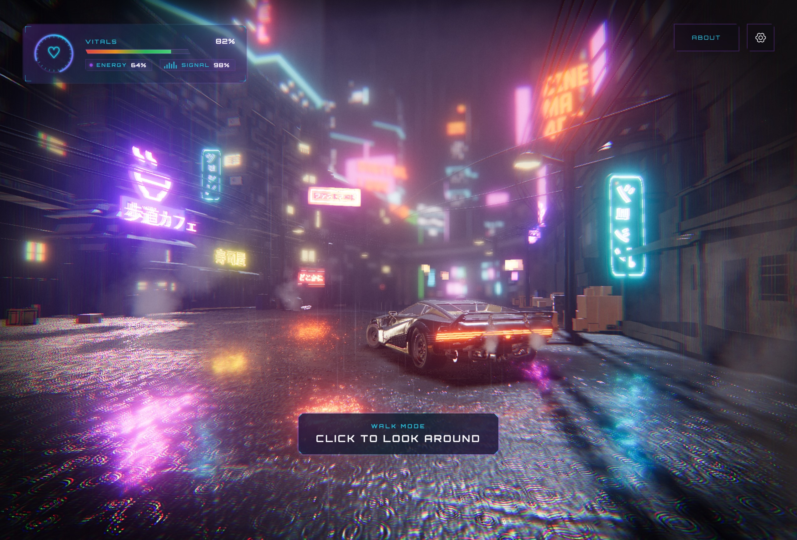
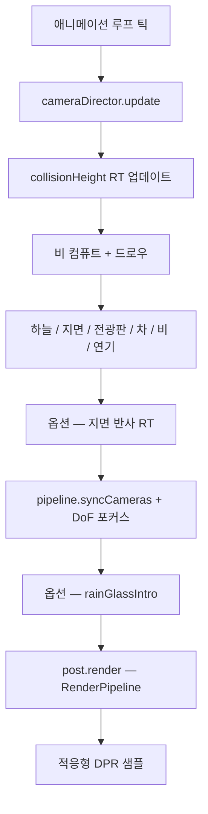

# Threejs-Punk (한글화)

<p align="center"></p>

**WebGPU**, **Three.js**, 그리고 **TSL**(Three Shading Language)로 구현된 **빗속 사이버펑크 골목**을 걸어보세요. 네온 전광판, 젖은 노면, 지붕과 소품을 인지하는 GPU 비, 시네마틱한 후처리, 그리고 BVH 충돌 기반 1인칭 탐색을 제공합니다.

| 항목 | 내용 |
|------|------|
| **라이브 데모** | [https://threejspunk.vercel.app/](https://threejspunk.vercel.app/) |
| **원작자** | [Anderson Mancini](https://andersonmancini.dev/) · **Sunag** (TSL 창시자) |
| **배경** | [TSL 워크숍 2026](https://threejs.paris/)을 위해 개정 |
| **기술 스택** | Three.js `^0.185` (WebGPU + TSL), Vite 6, `three-mesh-bvh`, GSAP |
| **라이선스 (코드)** | MIT — Anderson Mancini, Sunag |
| **에셋 라이선스** | 각 에셋별 상이 — 배포 전 확인 필요 |

워크숍에 참여해 주신 모든 분들께 감사드립니다 — 정말 잊지 못할 경험이었습니다.

---

## 한글화 안내

이 저장소는 **`ektogamat/threejs-conference`** 의 한글화 버전입니다. 모든 사용자 인터페이스 (인트로, HUD, 설정, 정보 패널, 워크숍 안내 등)를 한국어로 번역했으며, 내부 셰이더 코드는 그대로 유지했습니다. 다음 항목을 번역했습니다:

- 인트로 오버레이 ("유리를 너머로" / "네온 아래 빗속 골목" / "입장")
- 로딩 화면 상태 ("씬 부팅 중", "렌더러 준비 중", "WEBGPU 연결 중", "메시 로딩 중", "월드 연결 중", "조명 동기화 중", "포스트 효과 연결 중", "섹터 조립 중")
- 헤더 (정보 / 소스 / 설정)
- 정보 패널 전체
- 설정 패널 (룩 프리셋 6종: 중립 / 네온 누아르 / 마젠타 비 / 틸 황혼 / 사일런트 힐 / 씬 시티, 개발자 모드, 설정 초기화)
- 워크 컨트롤 힌트 (이동 / 달리기 / 앉기 / 시점)
- 워크 프롬프트 / 이동 힌트
- 오디오 토글
- 성능 안내 ("성능 조정 중")
- 개발자 인스펙터의 모든 폴더/라벨 (포스트 효과, 룩, 색 보정, 색수차, 비네팅, 그레인, 환경맵, 블룸, 성능, 렌즈 플레어, 지면, 전광판, 비, 연기, 배기관, 지면 김, 비행기, 경로 점, 카메라, 걷기)
- 메타데이터 (`<title>`, Open Graph, Twitter, JSON-LD, `<html lang>`)

원본 영문 README는 [`README.en.md.bak`](./README.en.md.bak)에 백업해 두었습니다.

---

## 빠른 시작

**요구 사항:** **WebGPU** 지원 브라우저, 그리고 로컬 개발용 Node.js.

```bash
npm install
npm run dev      # Vite 개발 서버 (@vitejs/plugin-basic-ssl 로 HTTPS — WebGPU 는 보안 컨텍스트가 필요)
npm run build    # 정적 빌드 (dist/)
npm run preview  # 빌드 결과 로컬 미리보기
```

로더가 끝나면 인트로 오버레이에서 **"입장"** 을 클릭하세요 (`FEATURES.intro = false` 면 스킵). 그 후 1인칭 워크 모드에서 **클릭** 해서 둘러보시면 됩니다. 설정 패널에서는 룩 프리셋, 오디오, 그리고 (개발자 모드 활성화 시) Three.js 인스펙터를 사용할 수 있습니다.

---

## 이 문서의 읽는 법

이 README 는 **사람 개발자를 위한 지식 베이스** 입니다. 각 주요 기법은 **소스 파일** 과 진입 **함수/클래스** 를 명시합니다. README 가 코드와 어긋난다면 **코드가 진실** 입니다.

**코딩 에이전트(Cursor, Claude Code 등)** 는 **[AGENTS.md](./AGENTS.md)** 부터 시작하세요 — 읽는 순서, 하드 제약, 파일 라우팅, 단계별 **기법 레시피**, 검증 체크리스트가 정리되어 있습니다. 심화 자료: **[docs/techniques/](./docs/techniques/README.md)** (충돌 비, 젖은 지면, 자동차 물방울).

---

## 아키텍처

이 앱은 **게임 엔진이 아닙니다**. 명시적인 라이프사이클을 가진 평범한 객체들을 [`src/main.js`](src/main.js) 에서 이어 붙인 **팩토리 합성** 입니다 — ECS 도 없고, 단일 씬 클래스도 없습니다.

### 부트스트랩 / 시작 순서

1. **디바이스 예산** — [`applyDevicePerformanceDefaults()`](src/platform/performanceProfile.js) 와 레이아웃 클래스 ([`deviceLayout.js`](src/platform/deviceLayout.js)).
2. **코어** — 카메라 ([`bootstrap/createCamera.js`](src/bootstrap/createCamera.js)), 씬 + 태양 ([`world/scene.js`](src/world/scene.js)), WebGPU 렌더러 ([`bootstrap/createRenderer.js`](src/bootstrap/createRenderer.js)).
3. **월드** — 병렬 GLTF 로딩, 옵션 기능 ([`world/createWorld.js`](src/world/createWorld.js)).
4. **조명 + 환경** — HDR 환경맵, 강도 컨트롤러.
5. **포스트** — TSL `RenderPipeline` ([`post/postprocessing.js`](src/post/postprocessing.js)) + localStorage 의 사이버펑크 룩 프리셋.
6. **런타임** — 적응형 DPR (인트로 종료 후 활성화), 카메라 디렉터 (궤도 / 워크), 앱 셸, 오디오, 인트로 플로우.
7. **웜업** — 셰이더 컴파일 분할 ([`runtime/warmup.js`](src/runtime/warmup.js)). Safari 는 컴파일이 끝날 때까지 애니메이션 루프를 막을 수 있습니다.
8. **루프** — [`createRenderLoop`](src/runtime/createRenderLoop.js) 시작. 인트로는 그 위에서 비동기로 실행.

### 한 프레임 (단순화)



### 폴더 맵

```
src/
├── main.js                 앱 루트 — 모든 것을 연결
├── bootstrap/              WebGPU 렌더러, 카메라
├── app/                    로더 오버레이, 앱 셸, 인트로 플로우
├── intro/                  빗 유리 인트로 컨트롤러
├── runtime/                렌더 루프, 카메라 디렉터, 셰이더 웜업
├── controls/               BVH 1인칭 워크
├── world/                  씬 콘텐츠 — 도시, 차, 지면, 날씨, 이펙트, 로더
├── clouds/                 절차적 구름 하늘 (TSL)
├── post/                   풀스크린 TSL 파이프라인 + 사이버펑크 룩
├── tsl/                    재사용 가능한 TSL 노드 (비, 블러, 색수차, 파문)
├── platform/               DPR, 디바이스 레이아웃, 성능 프로파일, 사용자 설정
├── ui/                     DOM 크롬, 워크 HUD, 가상 조이스틱
├── audio/                  공간 음향 엔진, 젖은 발소리
└── debug/                  인스펙터 세션, 개발자 API, 성능 도구
```

**에셋** 은 `public/` 아래에 있습니다 (Draco/Basis 트랜스코더 라이브러리, 압축 GLB, 텍스처, HDRI, 전광판 영상, 오디오).

### 로딩 파이프라인

[`world/loaders/createGltfLoaders.js`](src/world/loaders/createGltfLoaders.js) 의 공유 싱글톤:

- **GLTFLoader** + **DRACOLoader** (`/libs/draco/`)
- **KTX2Loader** (`/libs/basis/`) — WebGPU 용 `detectSupport(renderer)` 사용

도시 모델은 `cyberpunk_compressed.glb` 와 `colider.glb` 의 보이지 않는 경계 메시를 함께 로드합니다. 워크 충돌을 위한 BVH 는 [`world/bvh.js`](src/world/bvh.js) 에서 빌드됩니다.

### 기능 플래그

[`src/world/features.js`](src/world/features.js) 에서 토글합니다. 비활성화된 기능은 `null` 을 반환합니다. 렌더 루프와 포스트 파이프라인은 옵셔널 체이닝을 일관되게 사용합니다.

씬을 **벗겨내야** 할 때 (어떤 폴더를 무시할지, 권장 순서) 는 **[STRIP.md](./STRIP.md)** 를 참고하세요 — 이 문서에 중복 기재하지 않습니다.

### 카메라와 워크

[`createCameraDirector`](src/runtime/createCameraDirector.js) 는 **OrbitControls** (인트로 종료 후) 와 **워크 모드** ([`controls/createWalkControls.js`](src/controls/createWalkControls.js)) 사이를 전환합니다. 워크는 도시 + 경계 + 차 메시에 `three-mesh-bvh` 를 사용합니다. 피사계 심도 (DoF) 포커스는 GSAP 으로 스무딩된 **포커스 포인트** 를 따라가며 (궤도에서는 클릭, 워크에서는 시선 광선을 따라 갱신) 움직입니다.

---

## 이 씬이 빠르게 유지되는 이유

대부분의 "AI 가 만든" Three.js 데모는 무거운 이펙트를 계속 쌓아 GPU 를 질식시킵니다. 이 프로젝트는 **비주얼과 프레임 타임의 균형** 이 잡힐 때까지 반복 다듬어졌습니다. 모든 레버는 코드에 명시되어 있습니다.

| 아이디어 | 무엇을 하는가 | 위치 |
|----------|---------------|------|
| **TSL 노드 그래프** | 재사용 가능한 `Fn()` 서브그래프, 머티리얼 노드 슬롯 — 수기로 작성한 GLSL 문자열 없음 | `src/tsl/`, `world/`, `post/` 의 머티리얼 |
| **GPU 충돌 비** | 위에서 내려다보는 **하이트 텍스처** + **컴퓨트** 갱신 — 매 드롭당 CPU 레이캐스트 없음 | [`createCollisionHeight.js`](src/world/weather/createCollisionHeight.js), [`createCollisionRain.js`](src/world/weather/createCollisionRain.js) |
| **하프 해상도 패스** | GTAO, 블룸, 렌즈 플레어, 지면 반사 RT 를 축소 해상도로 | [`performanceProfile.js`](src/platform/performanceProfile.js) |
| **렌더 레이어** | 비는 레이어 2, 연기는 레이어 3 — AO 프리패스에서 제외해 법선을 망가뜨리지 않음 | [`postprocessing.js`](src/post/postprocessing.js), 날씨/연기 모듈 |
| **프레임 스킵** | 충돌 하이트맵과 지면 반사는 매 프레임 갱신할 필요 없음 | `collisionRainFrameSkip`, `groundReflectionFrameSkip` |
| **거리 페이드** | 차 표면 비 강도는 ~20–32 m 너머에서 줄어듦 | [`applyCarSurfaceRain.js`](src/world/car/applyCarSurfaceRain.js) |
| **컴파일 분할** | 크리티컬 패스가 도시/지면/뷰티부터 먼저 컴파일. 비/연기/비행기는 인트로 동안 지연 | [`warmup.js`](src/runtime/warmup.js) |
| **디바이스 정책** | 모바일은 렌즈 플레어, 전광판, GTAO 비활성화. Safari 는 DPR 캡, 적응형 DPR / DoF 비활성화 | [`applyDevicePerformanceDefaults`](src/platform/performanceProfile.js) |
| **적응형 DPR** | 단방향 FPS 기반 다운그레이드 (옵션. 일관된 해상도가 필요하면 비활성화) | [`adaptiveDpr.js`](src/platform/adaptiveDpr.js) |

### SSR 포크 (역사, 중요)

초기 버전에서는 **스크린 스페이스 리플렉션 (SSR)** 을 실험했었습니다. 커밋 **`ea84fd7`** ("Version without SSR") 에서 그 경로를 제거했습니다. 오늘날의 젖은 거리는 **수동 플래너 반사** 렌더 타깃과 roughness 기반 강도를 [`createGround.js`](src/world/ground/createGround.js) 에서 사용합니다 — WebGPU 의 TSL `PassNode` 그래프 안에서 더 저렴하고 안정적입니다 (내장 `reflector()` 헬퍼는 패스 애태치먼트와 충돌하는 곳을 피했습니다).

이 절충이 씬이 **반사적으로 느껴지면서도** 워크숍 노트북과 폰에서 잘 동작하는 이유의 상당 부분입니다.

---

## 충돌 비 — "히트" 하이트 텍스처

이 프로젝트의 핵심 기법입니다. 수천 개의 빗줄기와 튀김 효과가 **지붕, 차, 지면 위에 떨어지되** 프레임당 CPU 레이캐스트를 쓰지 않습니다.

**심화 자료 (에이전트 & 이식용):** [docs/techniques/collision-rain.md](docs/techniques/collision-rain.md) — 다이어그램, 숨김 리스트, 프레임 순서, 성능 노브, 재현 체크리스트. 인덱스: [docs/techniques/README.md](docs/techniques/README.md).

### 문제

단순한 비: 입자가 지오메트리를 뚫고 떨어지거나, 매 프레임 도시 메시 전체에 대해 비싼 레이 테스트가 필요합니다.

### 해결

1. 매 프레임 (또는 N 프레임마다) **충돌 하이트맵** 을 굽습니다.
2. GPU 컴퓨트 셰이더로 드롭을 시뮬레이션하면서, 드롭 좌표 `(worldX, worldZ)` 에서 그 맵을 **샘플링** 해서 **월드 Y** 를 바닥으로 읽습니다.

### 1 단계 — `createCollisionHeight`

파일: [`src/world/weather/createCollisionHeight.js`](src/world/weather/createCollisionHeight.js)

- 직교 카메라가 `cameraHeight` (기본 50) 에서 **수직 하향** 으로 봅니다.
- **이동하는 볼륨** (기본 **100×100** 월드 유닛) 이 플레이어 카메라 중심을 유지합니다.
- 렌더 타깃: **512×512** half-float (`performanceProfile.collisionRainResolution`), **nearest** 필터, **mipmap 없음** — 날카로운 하이트 텍셀, 경계에서 평균이 섞이지 않음.
- `scene.overrideMaterial` 은 `MeshBasicNodeMaterial` 을 사용:

  `outputNode = vec4(positionWorld, 1)` — 각 텍셀은 그 칸의 최상단 표면 **월드 좌표** 를 저장합니다. 비는 **Y 컴포넌트** 만 사용합니다.
- **`getUV(worldPos)`** — 월드 XZ 를 볼륨 중심 기준 `[0,1]²` 로 매핑 (컴퓨트에서 사용).
- **`getPosition(uv)`** — UV 를 다시 월드 XZ 로 역매핑 (디버깅 / 다른 이펙트용 헬퍼).

### 2 단계 — 가짜 "바닥" 숨기기

파일: [`src/world/weather/collisionHideObjects.js`](src/world/weather/collisionHideObjects.js)

하이트 패스 동안 **비, 하늘, 연기, 비행기** 는 RT 에 렌더되면 안 됩니다 — 입자와 하늘이 충돌 표면이 되어버립니다. [`collectCollisionHideObjects()`](src/world/weather/collisionHideObjects.js) 가 `collisionHeight.update({ hideObjects })` 의 숨김 리스트를 제공합니다.

### 3 단계 — GPU 비 + 튀김

파일: [`src/world/weather/createCollisionRain.js`](src/world/weather/createCollisionRain.js)

- 위치, 속도, 튀김 위상용 **`instancedArray`** 버퍼 — **`renderer.compute()`** 로 갱신.
- **초기화 컴퓨트**: 비 박스 안의 무작위 XZ, Y 범위, 분산을 가진 하강 속도.
- **업데이트 컴퓨트**: 운동 적분, 카메라 중심 볼륨에서의 **토로이달 랩**, 하이트 텍스처 샘플링, `floorY + epsilon` 아래로 내려가면 (GPU 에서 TSL `If` 분기로) 위로 **리스폰**.
- **튀김 컴퓨트**: `water-splash.webp` 의 아틀라스 애니메이션. Y 는 같은 하이트맵에서 스냅.
- **드로우**: 비와 튀김 패스마다 인스턴스드 `PlaneGeometry` 하나. `vertexNode` 의 **`billboarding()`**, `opacityNode` 의 줄무늬 마스크.
- 비는 **레이어 2** 에서 렌더 (`setRainLayer`). 메인 뷰티 패스에서 합성됨 (`useDedicatedPass: false` — 전용 비 패스는 포스트에 존재하지만 이 구현에서는 미사용).

기본 **5000** 줄무늬 인스턴스 (`collisionRainCount`). [`performanceProfile.js`](src/platform/performanceProfile.js) 에서 조절.

### 진화

2026년 9월 **비 업데이트** (커밋 `89e766f`) 는 줄무늬만 쓰던 이전 시스템 (`createRainStreaks.js`, 삭제됨) 을 이 하이트맵 + 컴퓨트 아키텍처로 교체했습니다 — 정확성과 확장성 모두 큰 개선이었습니다.

### 재현 레시피 (다른 프로젝트에 가져올 때)

1. **월드 좌표** (또는 최소한 월드 Y) 를 출력하는 정수 **위에서 아래로** 패스 하나 추가. **nearest** 필터의 RT.
2. 정수 프러스텀을 카메라에 중심을 두고 월드 XZ 풋프린트는 적당히 작게 (예: 100 m).
3. 매 프레임 (또는 N 프레임마다): 오버라이드 머티리얼로 씬 렌더. 입자 / 하늘은 그 패스에서 숨김.
4. **컴퓨트** 또는 버텍스 셰이더에서: 드롭 위치 적분, XZ → UV 매핑, `floorY = texture(heightMap, uv).y`, 교차하면 리스폰.
5. 비는 카메라를 향한 쿼드를 **인스턴스드 메시 1개** 로 드로우.
6. **해상도**, **인스턴스 수**, **프레임 스킵** 을 중앙 예산 노브로 노출.

---

## 젖은 표면 — 두 개의 별도 시스템

헷갈리지 마세요: **차는 절차적 물방울을, 지면은 파문 + 반사를 사용합니다.**

심화: [wet ground](docs/techniques/wet-ground.md) · [car surface rain](docs/techniques/car-surface-rain.md).

### 차 — 절차적 표면 비 (TSL)

파일: [`src/tsl/surfaceRain.js`](src/tsl/surfaceRain.js), [`src/world/car/applyCarSurfaceRain.js`](src/world/car/applyCarSurfaceRain.js)

- 드롭 모션은 **[rocksdanister/rain](https://github.com/rocksdanister/rain)** 에서 차용 (소스에 크레딧 명시): 그리드 해시, 정적 방울, 이동 레이어, 자국, 위성 드롭.
- **`evaluateCarSurfaceRain`**: 공유 유니폼 블록, 드롭 마스크에서 **유한 차분** 법선 (`computeCarDropNormalOffset`).
- 도장 → `MeshStandardNodeMaterial`. 유리 → `MeshPhysicalNodeMaterial` (클리어코트 스타일의 wet read).
- **UV1** 이 비 (`uv(1)`) 를 구동. 알베도 / 러프니스 / 노멀 맵은 **UV0** (Quadra 모델의 UV 는 Blender 에서 보정됨).
- 차 경로에서는 정적 드롭 레이어 가중치를 비활성화 (이동 레이어만) — UV1 의 "깜빡임" 방지.
- **러프니스** 와 **노멀** 노드는 비 마스크 × 강도로 wet 값 쪽으로 믹스. **근접 페이드** 가 ~32 m 너머에서 비를 0 으로 만듦.

### 지면 — 파문 + 플래너 반사

파일: [`src/tsl/rainRipples.js`](src/tsl/rainRipples.js), [`src/world/ground/createGround.js`](src/world/ground/createGround.js)

- **파문**: 월드 XZ 위 TSL 의 고정 **5×5 이웃 루프** — 시뮬레이션 텍스처 없이 확장하는 링 법선.
- **Wet PBR** 타일 (albedo / roughness / normal).
- **반사**: 별도 **하프 해상도** RT (`groundResolutionScale: 0.5`), 옵션 프레임 스킵. 경사 클립 평면을 가진 수동 미러 카메라. 미러 카메라에서는 비 레이어 비활성.
- **Emissive** 채널이 반사 × `(1 - roughness)` 를 실어 나름. SSR 없이도 wet 영역이 네온을 받아냅니다.

---

## 인트로 — 유리 위의 빗방울

파일: [`src/tsl/rainGlass.js`](src/tsl/rainGlass.js), [`src/intro/createRainGlassIntro.js`](src/intro/createRainGlassIntro.js)

같은 **드롭 그래프** 를 화면 UV 에 종횡비를 보정해 적용하고, 굴절 오프셋과 축소 해상도 블러를 디스토션 전에 더합니다. 인트로 동안 뷰티 출력 위에 `amount` 유니폼으로 믹스. 유리가 이미 이미지를 흐리게 하므로 **DoF 와 렌즈 플레어는 톤 다운**. 인트로 종료 시 디스포즈 — [`postprocessing.js`](src/post/postprocessing.js) 의 `disposeIntroRainGlass` 참고.

---

## 후처리와 룩

파일: [`src/post/postprocessing.js`](src/post/postprocessing.js)

파이프라인 스케치:

1. **GTAO 프리패스** (법선 MRT. 비 / 연기 레이어 OFF) → AO 를 뷰티에 곱함.
2. **씬 패스** **MRT** 사용: 컬러 + **emissive** (네온 전광판의 블룸 구동).
3. **블룸** (emissive 에 하프 해상도), 옵션 **렌즈 플레어** 체인.
4. **DoF** — 분리형 박스 블러 ([`src/tsl/boxBlur.js`](src/tsl/boxBlur.js)), 뷰 공간 깊이와 포커스 포인트 차이로 믹스. **Safari 에서는 비활성**.
5. **사이버펑크 그레이드** — [`createCyberpunkLook`](src/post/look/cyberpunkLook.js): 듀얼 포그 (지오메트리 + 하늘), 콘트라스트 / 채도, **엣지 색수차** ([`edgeChromaticAberration.js`](src/tsl/edgeChromaticAberration.js)), 비네팅, 필름 그레인.
6. **SMAA** (프로파일별 옵션).

**룩 프리셋** (설정에 저장): `neutral`, `neonNoir` (기본), `magentaRain`, `tealDusk`, `silentHill`, `sinCity` — 각각 블룸, 그레이드, 색수차, 비네팅, 그레인을 [`cyberpunkLook.js`](src/post/look/cyberpunkLook.js) 의 `LOOK_PRESETS` 로 조절.

### 하늘

[`src/clouds/cloudsMaterial.js`](src/clouds/cloudsMaterial.js) — 안쪽을 향한 구에 절차적 2D 노이즈. 미리 구워 둔 노이즈 텍스처 사용. 돔은 카메라 XZ 를 따라가며, 태양 틴트는 [`createCloudSky.js`](src/clouds/createCloudSky.js) 가 담당.

### 비디오 전광판

[`billboardFaceShader.js`](src/world/billboards/materials/billboardFaceShader.js) — 미니멀 TSL: 비디오 샘플 × 방사형 비네팅. **`emissiveNode`** 가 블룸 MRT 를 구동. CPU 거리 컬링으로 비디오 재생 / 일시정지를 토글해 디코드 비용을 절약합니다.

### 연기

[`createSmoke.js`](src/world/effects/createSmoke.js) — 인스턴스드 스프라이트 퍼프 (배기관 + 주변). GTAO 프리패스에서는 레이어 3 제외.

### 워크 충돌

[`createWalkControls.js`](src/controls/createWalkControls.js) + [`bvh.js`](src/world/bvh.js) — 포인터 락 이동, 계단 처리, 스프린트 FOV, 앉기. 모바일은 [`createWalkInputFacade.js`](src/ui/walk/createWalkInputFacade.js) 를 통해 가상 조이스틱 사용.

---

## 따라해 볼 만한 TSL 패턴

이 저장소에서 일관되게 쓰는 패턴들 — 에이전트 프롬프트나 이식 시 유용합니다.

| 패턴 | 이 프로젝트에서의 사용 |
|------|------------------------|
| **`Fn(() => …)()`** | 드롭 레이어, 포그, 콘트라스트, 파문 루프 |
| **`uniform()` + `needsUpdate`** | CPU 구동 파라미터 (룩, 비 강도, 인트로 유리) |
| **컴퓨트의 `texture(rt, uv)`** | 비 시뮬레이션의 충돌 하이트 샘플링 |
| **`.compute(count)` + `renderer.compute()`** | 비와 튀김 입자 갱신 |
| **`billboarding({ position })`** | 인스턴스드 비 / 튀김 쿼드 |
| **컴퓨트의 `If(cond, () => …)`** | 리드백 없는 GPU 측 리스폰 |
| **TSL 의 `Loop`** | 파문 이웃, 분리형 블러 탭 |
| **커스텀 `TempNode`** | `EdgeChromaticAberrationNode` |
| **머티리얼 노드 오버라이드** | `colorNode`, `roughnessNode`, `normalNode`, `emissiveNode`, `opacityNode`, `vertexNode`, `outputNode` — ShaderMaterial 문자열 대신 |
| **`RenderPipeline` + `post.outputNode`** | 뷰티 + 그레이드를 하나의 그래프로. 룩 / 성능 / 인트로 변경 시 리빌드 |

임포트 경로: **`three/webgpu`**, **`three/tsl`**, 디스플레이 노드는 **`three/addons/tsl/display/`** 하위.

---

## 이 프로젝트의 진화

~103 커밋 (2026년 7월–9월) 의 짧은 내러티브 — 전체 변경 로그는 아닙니다:

1. **최초의 사이버펑크 골목** — WebGPU 렌더러, 초기 포스트 스택, 사이버펑크 컬러 그레이드 (`1c93c48`).
2. **SSR 실험, 그리고 제거** — wet 룩이 **플래너 반사 + 러프니스** 로 피벗 (`ea84fd7`).
3. **인터랙션** — GSAP 포커스, BVH 워크, 스프린트 / 앉기, 로더 폴리싱.
4. **비 어휘** — 화면 비 유리, 지면 **파문**, 날씨 인스펙터 튜닝.
5. **리스트럭처** — `src/` 가 bootstrap / world / post / runtime / platform / ui 로 분리 (`52b6b96`). **[STRIP.md](./STRIP.md)** 가 레이어 제거 절차를 문서화.
6. **콘텐츠** — 절차적 구름 하늘, **비디오 전광판**, 차의 **표면 물방울** (UV1), 연기, 비행기, 공간 음향.
7. **성능 패스** — 적응형 DPR, **셰이더 컴파일 분할**, 모바일 / Safari 게이트, 분리형 DoF 블러, 지면 반사 예산.
8. **GTAO + 룩 프리셋** — 컨택트 다크닝과 6 종 그레이드를 설정에 추가.
9. **충돌 비** — 하이트 텍스처 + 컴퓨트가 줄무늬만 쓰던 비를 대체 (`89e766f`). 튀김 아틀라스, 하이트 패스 숨김 리스트.

일관된 흐름: **모든 화려한 이펙트는 결국 GPU 로 옮겨지거나, 해상도를 낮추거나, WebGPU 안정성과 싸우면 잘라냈다** (SSR, 전 해상도 올인, 드롭당 CPU 충돌).

---

## 소스 맵

| 이펙트 | 메인 파일 | 진입점 |
|--------|-----------|--------|
| 앱 와이어링 | `src/main.js` | `init` |
| WebGPU 렌더러 | `src/bootstrap/createRenderer.js` | `createRenderer` |
| 월드 어셈블리 | `src/world/createWorld.js` | `createWorld` |
| 충돌 하이트 RT | `src/world/weather/createCollisionHeight.js` | `createCollisionHeight`, `CollisionHeight` |
| GPU 비 + 튀김 | `src/world/weather/createCollisionRain.js` | `createCollisionRain` |
| 하이트 패스 숨김 리스트 | `src/world/weather/collisionHideObjects.js` | `collectCollisionHideObjects` |
| 지면 wet + 반사 | `src/world/ground/createGround.js` | `createGround`, `updateReflection` |
| 지면 파문 TSL | `src/tsl/rainRipples.js` | `createRainRipples` |
| 차 물방울 TSL | `src/tsl/surfaceRain.js` | `evaluateCarSurfaceRain`, `MovingDropLayer` |
| 차 머티리얼 와이어링 | `src/world/car/applyCarSurfaceRain.js` | `applyCarSurfaceRain` |
| 인트로 비 유리 | `src/tsl/rainGlass.js` | `applyRainGlass` |
| 포스트 파이프라인 | `src/post/postprocessing.js` | `createPostProcessing` |
| 룩 프리셋 | `src/post/look/cyberpunkLook.js` | `createCyberpunkLook`, `LOOK_PRESETS` |
| 엣지 색수차 | `src/tsl/edgeChromaticAberration.js` | `edgeChromaticAberration` |
| 분리형 블러 (DoF) | `src/tsl/boxBlur.js` | `boxBlurSeparable` |
| 구름 하늘 | `src/clouds/cloudsMaterial.js` | `createCloudsMaterial` |
| 전광판 비디오 면 | `src/world/billboards/materials/billboardFaceShader.js` | `createBillboardFaceOutput` |
| 연기 | `src/world/effects/createSmoke.js` | `createSmoke` |
| 워크 + BVH | `src/controls/createWalkControls.js`, `src/world/bvh.js` | `createWalkControls`, `buildModelBvh` |
| 카메라 모드 | `src/runtime/createCameraDirector.js` | `createCameraDirector` |
| 프레임 루프 | `src/runtime/createRenderLoop.js` | `createRenderLoop` |
| 셰이더 웜업 | `src/runtime/warmup.js` | `finalizeStartupLighting`, `compileDeferredStartup` |
| 성능 노브 | `src/platform/performanceProfile.js` | `performanceProfile`, `applyDevicePerformanceDefaults` |
| 기능 플래그 | `src/world/features.js` | `FEATURES` |
| 스트립 가이드 | `STRIP.md` | — |
| GLTF + Draco + KTX2 | `src/world/loaders/createGltfLoaders.js` | `getGltfLoader` |

---

## 개발자 모드

설정에서 **개발자 모드** 를 켜면 Three.js **인스펙터** ([`debug/setupInspector.js`](src/debug/setupInspector.js)) 가 노출됩니다. `window.__app` ([`createDevAppApi.js`](src/debug/createDevAppApi.js) 참고) 으로 런타임에 성능 플래그를 A/B 해보세요.

---

## 라이선스와 에셋

**코드** 는 [MIT](LICENSE) 라이선스입니다 — Copyright 2026 Anderson Mancini and Sunag.

**모델, 텍스처, 오디오, 비디오** 는 `public/` 아래에 있으며 그 라이선스에 포함되지 않습니다. 재배포 전에 각 에셋의 라이선스를 확인하세요. `src/tsl/surfaceRain.js` 의 차 드롭 그래프는 [rocksdanister/rain](https://github.com/rocksdanister/rain) 에서 차용했습니다. 그래프를 재사용할 경우 해당 크레딧을 유지해 주세요.

워크숍 참가자들이 크리에이티브 디렉션에 기여했습니다. 기술적 authorship 은 위와 같이 **Anderson Mancini** 과 **Sunag** 입니다.

---

## 한글화 작업 메모

원본 저장소 (ektogamat/threejs-conference) 의 모든 셰이더 / 비-UI 코드 식별자 (예: `MOVING_DROP_LAYER`, `OPAQUE`, `KOSMOS` 같은 식별자) 는 절대 손대지 않았습니다. 번역 대상은 사용자에게 노출되는 문자열과 메타데이터로 한정했습니다. 원본 영문 README 는 [`README.en.md.bak`](./README.en.md.bak) 에 그대로 보존되어 있습니다.

번역에 오류가 있거나 개선할 부분이 있다면 이슈로 알려 주세요.
